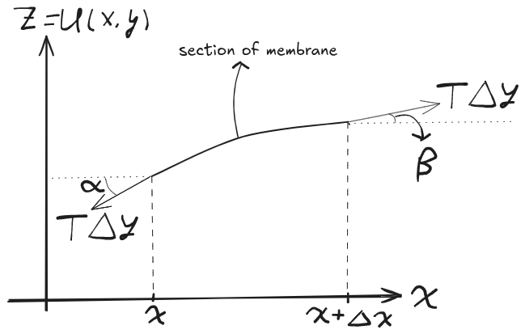

---
tags:
  - science/physics
  - assignment
title: "Musings on Membranes: A Derivation of the 2D Wave Equation"
author: Eben Quenneville
hauthor: Quenneville
instructor: Professor Holtrop
course: PHYS 616
date: \today
date-created: 2025-10-09
date-modified: 2025-12-05
---
## Introduction

In this project, we examine the physics of a drum head. By thinking of it as a membrane with tension at the circular boundary, we derive the 2D wave equation. The solutions to the equations of motion are then found in terms of Bessel functions, and examined for different initial conditions.

## Governing Equations

Consider a elastic circular membrane of radius $a$, perturbed from its rest state and let to oscillate. We seek to find an equation to govern the evolution of the membrane over time. Several simplifying physical assumptions are made to allow for analytic solutions. First, the membrane is considered to be a perfectly elastic, infinitesimally thin sheet with a surface mass density $\sigma$. It is clamped rigidly along its boundary, resulting in constant and uniform tension per unit length $T$. This tension will remain constant during vibration. Air resistance and dissipation effects due to tension and air are neglected.

The governing equation for the motion of the membrane comes from Newton's second law, as we shall now derive. First, consider a tiny, square patch of the membrane at rest. The tension forces pulling on its four sides are all in the horizontal plane and perfectly balance each other out. Let $z = u(x, y, t)$ describe the height of the membrane above or below rest of $z = 0$.

Now, the tiny section is imagined to be displaced vertically as part of a wave. The surface becomes curved, in which case the tension forces on each side of the patch are no longer aligned. The result is a net vertical force that tries to pull the patch back to its equilibrium position. This is the restoring force. Let the patch of membrane range from $x$ to $x + \Delta x$ and from $y$ to $y + \Delta y$. The mass of this patch is $m = \sigma \Delta x \Delta y$. Figure 1 depicts a disturbance to the membrane, along the $xz$-plane, with angles of inclination labeled $\alpha$ and $\beta$. These angles are grossly exaggerated to be visibly large and distinct. For the proceeding argument, however, we take the limit of a very small displacement to the membrane, such that $\alpha \approx \beta$ and $\sin(\alpha) \approx \tan(\alpha) \approx \dfrac{\partial u}{\partial x}$ and $\cos(\alpha) \approx 1$. 

{ width=100% }

An analogous argument can be made in the $yz$ plane, where instead $\sin(\alpha) \approx \frac{\partial u}{\partial y}$. Since the horizontal components all will be of magnitude $T \cos(\phi) \approx T$, where $\phi$ is the angle of inclination in that direction, the net horizontal force will be $0$. The vertical (along $z$) components of the tension are proportional to $T \sin(\phi) \approx T \frac{\partial u}{\partial x} \text{ or } T \frac{\partial u}{\partial y}$. We multiply each by the respective side length of the membrane, because our tension is in units of force per unit length. As the rectangular patch becomes smaller and smaller, this becomes a successively better approximation. The sum of the vertical forces is thus:

$$
F = T\left[\Delta y \frac{\partial u}{\partial x}(x + \Delta x, y) - \Delta y \frac{\partial u}{\partial x}(x, y) + \Delta x \frac{\partial u}{\partial y}(x, y + \Delta y) - \Delta x \frac{\partial u}{\partial y}(x, y)\right]
$$

To make progress, we now use the multivariable Taylor series approximation. We get that
$$
\frac{\partial u}{\partial x}(x + \Delta x, y) \approx \frac{\partial u}{\partial x}(x, y) + \frac{\partial^{2}u }{\partial x^{2}}(x, y) \Delta x
$$
and similarly
$$
\frac{\partial u}{\partial y} (x, y + \Delta y) \approx \frac{\partial u}{\partial y}(x, y) + \frac{\partial^{2} u}{\partial y^{2}}(x, y) \Delta y
$$
so then
$$
\begin{aligned}
F &= T\left[ \Delta y \left( \frac{\partial u}{\partial x}(x, y) + \frac{\partial^{2}u }{\partial x^{2}}(x, y) \Delta x - \frac{\partial u}{\partial x} (x, y) \right) + \Delta x\left( \frac{\partial u}{\partial y}(x, y) + \frac{\partial^{2} u}{\partial y^{2}}(x, y) \Delta y - \frac{\partial u}{\partial y}(x, y)\right) \right]\\
&= \Delta x \Delta y T \left(\frac{\partial^{2} u}{\partial x^{2}} + \frac{\partial^{2} u}{\partial y^{2}}\right)
\end{aligned}
$$
We apply Newton's Second Law:
$$
\begin{aligned}
m \vec{a}_{z} &= \vec{F}_{z}\\
\implies  m \frac{\partial^{2} u}{\partial t^{2}} &= \Delta x \Delta y T\left(\frac{\partial^{2} u}{\partial x^{2}} + \frac{\partial^{2} u}{\partial y^{2}}\right) \\
\implies  \Delta x \Delta y \sigma \frac{\partial^{2} u}{\partial t^{2}} &= \Delta x \Delta y T\left(\frac{\partial^{2} u}{\partial x^{2}} + \frac{\partial^{2} u}{\partial y^{2}}\right) \\
\implies \frac{\partial^{2} u}{\partial t^{2}} &= \frac{T}{\sigma} \left(\frac{\partial^{2} u}{\partial x^{2}} + \frac{\partial^{2} u}{\partial y^{2}}\right) \\
\implies \frac{\partial^{2} u}{\partial t^{2}} &= c^{2} \nabla^{2} u
\end{aligned}
$$
where it is convention to define $c = \sqrt{\frac{T}{\sigma}}$ for the last step. Physically, this parameter $c$ corresponds to the speed at which a wave is capable of propagating through our elastic membrane. 

## Transformation to Polar Coordinates

The above PDE is the general wave equation, with almost no respect to the particular problem of a drum head. For the physics, we apply the boundary conditions: $u(x, y, t) = 0$ along the boundary $x^{2} + y^{2}= a^{2}$, where $a$ is the radius of the drum. In this form, the boundary is quite difficult to apply, however. It is vastly more convenient to consider this from a polar coordinate system, wherein that constraint will become $r = a$. We thus change our spatial coordinates from $(x, y)$ to $(r, \theta)$. The "cost" of this change of basis is that the differential operator has a different expression in the polar basis. The Laplacian in polar coordinates, as derived in the appendix, is 
$$
\nabla^2 = \frac{1}{r} \frac{\partial}{\partial r} \left( r \frac{\partial}{\partial r} \right) + \frac{1}{r^2} \frac{\partial^2}{\partial \theta^2}
$$
The wave equation in polar form, which will be the basis for all subsequent analysis, is thus
$$
\boxed{\frac{1}{r} \frac{\partial}{\partial r} \left( r \frac{\partial u}{\partial r} \right) + \frac{1}{r^2} \frac{\partial^2 u}{\partial \theta^2} = \frac{1}{c^2} \frac{\partial^2 u}{\partial t^2}.}
$$

## Constraints and Conditions

We require that the membrane be fixed, giving a Dirichlet boundary condition of
$$
u(a, \theta, t) = 0 \quad \forall\, \theta, t \in \mathbb{R}
$$
Additionally, we have circular symmetry, giving periodicity in $\theta$:
$$
u(r, \theta, t) = u(r, \theta + 2\pi, t) \quad \text{and} \quad \frac{\partial u}{\partial \theta}(r, \theta, t) = \frac{\partial u}{\partial \theta}(r, \theta + 2\pi, t) 
$$
Finally, we shall be given some initial conditions for position and velocity everywhere on the drum. These correspond to the specific physical situation, like how the player struck the drum. We write the initial position as
$$
u(r, \theta, 0) = f(r, \theta)
$$
and the initial velocity as
$$
\frac{\partial u }{\partial t} (r, \theta, 0) = g(r, \theta)
$$
for some functions $f$ and $g$.

## Fundamental Modes via Separation of Variables

We expect the solution to have some angular dependence, radial dependence, and time dependence, but these different modes need not interact with each other. That is to say, we expect it to be *separable*. We denote the solution as 
$$
u(r, \theta, t) = R(r) \Theta(\theta) T(t)
$$
Very notably, we are saying that the *shape of the oscillation is independent of time*. This is the characteristic of a standing wave. We shall later write any state as a superposition of these fundamental modes. We now substitute this form into our polar wave equation:

$$
\begin{aligned}
&\frac{1}{r} \frac{\partial }{\partial r} \left(r \Theta(\theta) T(t) \frac{dR}{dr}\right) + \frac{1}{r^{2}} R(r)T(t) \frac{d^{2}\Theta}{d \theta^{2}} = \frac{1}{c^{2}} R(r) \Theta(\theta) \frac{d^{2}T}{dt^{2}}\\
\implies & \frac{1}{r} \frac{\partial }{\partial r} \left(r \frac{dR}{dr}\right)\Theta T + \frac{RT}{r^{2}} \frac{d^{2}\Theta}{d\theta^{2}} = \frac{1}{c^{2}}R \Theta \frac{d^{2}T}{dt^{2}} 
\end{aligned}
$$
What is interesting to observe here is that all of the terms on the left have a linear dependence on time, and the right hand side has the only time derivatives. We can therefore separate our variables by getting all time variables on the right hand side. The easiest way to do this is to just divide all terms by the product $u = R \Theta T$, yielding
$$
\frac{1}{ R r} \frac{\partial }{\partial r} \left(r \frac{dR}{dt}\right) + \frac{1}{r^{2} \Theta} \frac{d^{2}\Theta}{d\theta^{2}} = \frac{1}{c^{2}T} \frac{d^{2}T}{dt^{2}}  
$$
The left hand side has purely spatial dependence, but the right hand side has purely temporal dependence. The only way for the left hand side and right hand side to always be equal is if they both equal some constant. As this is somewhat like a harmonic oscillator, it is convenient to denote this constant by a negative value, say
$$
\frac{1}{c^{2} T} \frac{d^{2}T}{dt^{2}}= - \lambda^{2} \implies \frac{d^{2}T}{dt^{2}} + \omega^{2} T = 0 \quad (1) 
$$
This is a classic differential equation: a harmonic oscillator with $\omega = c \lambda$. The solution is 
$$
T(t) = Ae^{i \omega t} + Be^{-i \omega t}
$$
Next, we return to the spatial coordinates. We have
$$
\frac{1}{Rr} \frac{\partial }{\partial r} \left(r \frac{dR}{dt}\right) + \frac{1}{r^{2} \Theta} \frac{d^{2}\Theta}{d\theta^{2}} = - \lambda^{2} 
$$
which becomes
$$
\frac{r}{R} \frac{\partial  }{\partial r } \left(r \frac{dR}{dr} \right) + \lambda^{2} r^{2} = - \frac{1}{\Theta} \frac{d^{2}\Theta}{d\theta^{2}} 
$$
Once again, we claim that both sides must equal some constant, call it $m^{2}$. Then
$$
\frac{d^{2} \Theta}{ d \theta^{2}} = - m^{2} \Theta \implies  \Theta(\theta) = Ce^{im \theta} + De^{-im \theta}   
$$
Now, we require that the angular function $\Theta(\theta)$ to be periodic with period $2 \pi$, which forces $k \in \mathbb{Z}$. 

Finally, we return to the radial function:
$$
\begin{aligned}
0 &= r (R' + r R'') + \lambda^{2} r^{2} R - m^{2} R\\
&= r^{2}R'' + rR' + (\lambda^{2} r^{2} - m^{2}) R\\
&= R'' + \frac{1}{r}R' + \left(\lambda^{2} - \frac{m^{2}}{r^{2}}\right) R
\end{aligned}
$$
This differential equation is hard. This is sometimes called a Sturm-Liouville equation as it can be rewritten as
$$
\frac{d}{dr}(r R') + \left(\lambda^{2} - \frac{m^{2}}{r^{2}}\right) rR = 0
$$
The solutions are the Bessel functions of the first and second kind:
$$
R(r) = c_{1} J_{m}(\lambda r) + c_{2} Y_{m} (\lambda r)
$$
We define the Bessel function of the first kind $J_{n}(z)$ in terms of the generating function as
$$
e^{\frac{z}{2} (t-1/t)}=\sum\limits_{n=-\infty}^{\infty}t^{n}J_{n}(z).
$$
Then, the Bessel function of the second kind is written as
$$
Y_{\nu} (z) = \frac{J_{\nu}(z) \cos(\pi \nu)-J_{-\nu}(z)}{\sin(\pi \nu)}
$$
However, the Bessel function of the second kind approaches $- \infty$ as $r \to 0$. Since the center of the drum head cannot displace infinitely, we require that $c_{2} = 0$. 

Now, we can write the full solution as:
$$
u(r, \theta, t) = R(r) \Theta(\theta) T(t) = [c_{1} J_{m}(\lambda r)] [Ce^{im\theta} + De^{-im\theta}] [Ae^{i \omega t} + Be^{-i \omega t}]
$$

### Simplifications

First, since the drum head displacement is real, we can discard the complex exponentials and write
$$
\begin{aligned}
\Theta (\theta) &= A \cos(m \theta) + B \sin(m \theta)\\
T(t) &= C \cos(\omega t) + D \sin( \omega t)
\end{aligned}
$$
Next, we apply the boundary condition that 
$$
u(a, \theta, t) = 0 \implies J_{m}(\lambda a) = 0
$$
This means that $\lambda a$ must be a root of the Bessel function. Denote $\alpha_{mn}$ as the $n$th zero of the Bessel function $J_{m}$. Then the allowable values for $\lambda$ are discrete:
$$
\lambda_{mn} = \frac{\alpha_{mn}}{a} 
$$
and correspondingly
$$
\omega_{mn} = c \lambda_{mn} = \frac{c\alpha_{mn}}{a}
$$
Then our solution is 
$$
\begin{aligned}
u(r, \theta, t) = \sum\limits_{m=0}^{\infty} \sum\limits_{n=1}^{\infty} J_{m}(\lambda_{mn} r) [&(A_{mn} \cos(m \theta) + B_{mn} \sin(m \theta) )\cos( \omega_{mn} t)+\\&  (C_{mn} \cos(m \theta) + D_{mn} \sin(m \theta)) \sin(\omega_{mn} t)]
\end{aligned}
$$
where the coefficients $A_{mn}, B_{mn}, C_{mn}, D_{mn}$ are determined by the initial conditions of the drum.

## Coefficient Determination

Let $u(r, \theta, 0) = f(r, \theta)$ be the initial position of the drum. The terms involving $\sin(\omega_{mn}t)$ vanish at $t = 0$, and the cosine terms become 1. Thus,
$$
f(r, \theta) = \sum\limits_{m=0}^{\infty}\sum\limits_{n=1}^{\infty} J_{m}(\lambda_{mn} r) [A_{mn} \cos(m \theta) + B_{mn} \sin(m \theta)]
$$
Now, to isolate specific coefficients, we can rely on the orthogonality of basis functions. We know from earlier in the semester that the inner product of $\cos(m \theta)$ and $\cos(n \theta)$ is 0 if $m \neq n$, and similarly for sines. So, we can separate the $m$th term by multiplying our equation by $\cos(m \theta)$ or $\sin(m \theta)$ and integrating from $0$ to $2 \pi$. In particular,
$$
\int\limits_{0}^{2\pi}{f(r, \theta) \cos(m \theta)d \theta} = \pi \sum\limits_{n=1} A_{mn} J_{m}(\lambda_{mn} r)
$$
Note that if $m = 0$, the factor is $2 \pi$ instead of $\pi$. 

We are now left with a series of Bessel functions. By construction, the Bessel functions $J_{m}(\lambda_{mn} r)$ form an orthogonal set on $[0, a]$, with respect to the weight function $w(r) = r$. So 
$$
\int\limits_{0}^{a}{J_{m}(\lambda_{mn} r) J_{m}(\lambda_{mp}) r dr} = \begin{cases}
0 & \text{if } n \neq p\\
\frac{a^{2}}{2} [J_{m+1}(\alpha_{mn})]^{2} &\text{if } n = p
\end{cases}
$$
where still $\alpha_{mn} = \lambda_{mn} a$ is a zero of the $m$-th Bessel function. So, we take the result from angular integration, and multiply by $J_{m}(\lambda_{mn} r) \cdot r$ and integrate from $0$ to $a$:

$$
\int\limits_{0}^{a} \left[ \int\limits_{0}^{2\pi}{f(r, \theta) \cos(m \theta)d \theta}\right] J_{m} (\lambda_{mn}r)r ~dr = \pi A_{mn} \frac{a^{2}}{2} J_{m+1}^{2} (\alpha_{mn})
$$
We then rearrange for $A_{mn}$ to get
$$
A_{mn} = \frac{2}{\pi a^{2} J_{m+1}^{2} (\alpha_{mn})} \int\limits_{0}^{a} \int\limits_{0}^{2 \pi}{f(r, \theta) J_{m}(\lambda_{mn} r) \cos(m \theta) r ~dr ~d \theta}
$$
The exact same logic for the sine terms resolves $B_{mn}$ to be 
$$
B_{mn} = \frac{2}{\pi a^{2} J_{m+1}^{2}(\alpha_{mn})} \int\limits_{0 }^{a} \int\limits_{0}^{2 \pi}{f(r, \theta) J_{m}(\lambda_{mn} r) \sin(m \theta)r ~dr ~d \theta}
$$
Finally, to find $C_{mn}$ and $D_{mn}$, we use the initial velocity condition $\frac{\partial u}{\partial t} = g(r, \theta)$ for some function $g$. Taking the time derivative will bring down an extra constant factor of $\omega_{mn}$. So, we get 
$$
C_{mn} = \frac{2}{\pi a^{2} \omega_{mn} J_{m+1} ^{2}(\alpha_{mn})} \int\limits_{0}^{a} \int\limits_{0}^{2\pi} g(r, \theta) J_{m}(\lambda_{mn}r) \cos(m \theta) r ~dr ~d \theta
$$
and 
$$
D_{mn} = \frac{2}{\pi a^{2} \omega_{mn} J_{m+1}^{2}(\alpha_{mn})} \int\limits_{0}^{a} \int\limits_{0}^{2 \pi}{g(r, \theta) J_{m}(\lambda_{mn} r) \sin(m \theta) r ~ dr ~d \theta}
$$

With this, we have the full mathematical framework complete.

## Programmatic Approach

Now, we have all of the tools in place to program solutions.

### Normal Modes

The first thing is to visualize the normal modes. For a given $m, n$ tuple, we can visualize the function 
$$
f(r, \theta) = J_{m}(\lambda_{mn} r) \cdot \cos(m \theta)
$$
as an indicator of the shape of the mode. We neglect the time dependence and consider only one of the trigonometry functions, since including it would only rotate the modes. We can then get a grid of modes for $m, n$ like the following:

{ width=100% }

We can alternately visualize these as an animation, which is included in the attached notebook.

### Time Evolution

Next, we can visualize how a particular initial condition of a drum would evolve for time. First, consider a Gaussian initial condition in position, centered at $r = 0$ and symmetric with respect to $\theta$:

$$
\begin{aligned}
f_\text{init}(r, \theta) &= \frac{1}{2} e^{(-20r^{2})}\\
g_\text{init}(r, \theta) &= 0.0
\end{aligned}
$$

We then use the mathematical approach from above to calculate the coefficients $A, B, C, D$ of each normal mode. A time series of the evolution over time is seen in the following figure:

{ width=100% }

The advantage of this approach is that we can create a much more interesting initial condition, like an off center peak described by 
$$
\begin{aligned}
f_{\text{init}}(r, \theta) &= \exp(-20(r^2 + 0.5^2 - r\cos(\theta))) \\
g_\text{init}(r, \theta) &= 0.0
\end{aligned}
$$
and the exact same math applies. We get an evolution like:

{ width=100% }

\newpage

## Further Studies

There are many interesting directions this project could be taken.

### Non-even Tension
Ia real drum, the tension is not applied evenly along the edge, but rather clamped down at certain points. While I have not yet found an analytic approach for this, we could simulate this numerically.

### Different Geometries

Instead of applying a circular boundary condition, we could take a different shape. What would the normal modes of a hexagon drum look like? Or a triangular one? 

### Forcing and Physical Simulation

I didn't account for forcing in this analytic derivation. We could create a physical simulation of this, by placing a speaker under a drum membrane and changing the frequency to create different forcings.

\newpage

## Appendix

### Derivation of the Laplacian Operator in Polar

In particular, we need to find the Laplacian. We let $x = r \cos(\theta)$ and $y = r \sin(\theta)$. Then, by the multivariable chain rule, 

$$
\frac{\partial }{\partial x} = \frac{\partial r}{\partial x} \frac{\partial }{\partial r} + \frac{\partial  \theta}{\partial x} \frac{\partial }{\partial \theta}, \quad\quad \frac{\partial }{\partial y} = \frac{\partial r}{\partial y} \frac{\partial }{\partial r} + \frac{\partial \theta}{\partial y} \frac{\partial }{\partial \theta}
$$
Computing those, we get
$$
\frac{\partial }{\partial x} = \cos(\theta) \frac{\partial }{\partial r} - \frac{\sin(\theta)}{r} \frac{\partial }{\partial \theta}
$$
and 
$$
\frac{\partial }{\partial y } = \sin(\theta) \frac{\partial }{\partial r} + \frac{\cos(\theta)}{r}\frac{\partial }{\partial \theta}
$$
It becomes convenient, at this point, to introduce a helper notation of $\frac{\partial }{\partial r} = \partial_{r}$ and $\frac{\partial }{\partial \theta} = \partial_\theta$. The following derivation will be easier for it. For smooth coefficient functions p,q and commuting partials $\partial_r,\partial_\theta$, we have the product rule identity:
$$
(p\partial_i)(q\partial_j) ~=~ p q\,\partial_i\partial_j + p(\partial_i q)\,\partial_j,
\qquad i,j\in\{r,\theta\}
$$
It is also convenient to introduce
$$
A=\cos\theta,\; B=-\dfrac{\sin\theta}{r},\; C=\sin\theta,\; D=\dfrac{\cos\theta}{r}
$$
$$
\begin{aligned}
&\partial_x^2 = (A\partial_r + B\partial_\theta)^2 \\[4pt]
&\qquad= (A\partial_r)(A\partial_r) + (A\partial_r)(B\partial_\theta)
         + (B\partial_\theta)(A\partial_r) + (B\partial_\theta)(B\partial_\theta)\\[6pt]
&\qquad= A^2\partial_r^2 \;+\; A(\partial_r A)\,\partial_r
      \;+\; AB\,\partial_r\partial_\theta \;+\; A(\partial_r B)\,\partial_\theta\\[4pt]
&\qquad\qquad
      +\; BA\,\partial_\theta\partial_r \;+\; B(\partial_\theta A)\,\partial_r
      \;+\; B^2\partial_\theta^2 \;+\; B(\partial_\theta B)\,\partial_\theta.\\[6pt]
\end{aligned}
$$
Similarly, we get
$$
\begin{aligned}
&\partial_y^2 = (C\partial_r + D\partial_\theta)^2 \\[4pt]
&\qquad= C^2\partial_r^2 \;+\; C(\partial_r C)\,\partial_r
      \;+\; CD\,\partial_r\partial_\theta \;+\; C(\partial_r D)\,\partial_\theta\\[4pt]
&\qquad\qquad
      +\; DC\,\partial_\theta\partial_r \;+\; D(\partial_\theta C)\,\partial_r
      \;+\; D^2\partial_\theta^2 \;+\; D(\partial_\theta D)\,\partial_\theta.
\end{aligned}
$$

Now substitute the simple derivatives of the coefficients:
$$
\begin{aligned}
&\qquad \partial_r A = 0,\quad \partial_\theta A = -\sin\theta,\\
&\qquad \partial_r B = \frac{\sin\theta}{r^2},\quad \partial_\theta B = -\frac{\cos\theta}{r},\\
&\qquad \partial_r C = 0,\quad \partial_\theta C = \cos\theta,\\
&\qquad \partial_r D = -\frac{\cos\theta}{r^2},\quad \partial_\theta D = -\frac{\sin\theta}{r}.
\end{aligned}
$$
And then collect terms in $\partial_r^2,\ \partial_r\partial_\theta,\ \partial_\theta^2,\ \partial_r,\ \partial_\theta$:
$$
\begin{aligned}
&\partial_x^2+\partial_y^2 = (A^2+C^2)\partial_r^2
   + (B^2+D^2)\partial_\theta^2
   + 2(AB+CD)\partial_r\partial_\theta\\[4pt]
&\qquad\qquad
   +\big(A(\partial_r A)+B(\partial_\theta A)+C(\partial_r C)+D(\partial_\theta C)\big)\partial_r\\[4pt]
&\qquad\qquad
   +\big(A(\partial_r B)+B(\partial_\theta B)+C(\partial_r D)+D(\partial_\theta D)\big)\partial_\theta.
\end{aligned}
$$
We can evaluate those coefficients one at a time:
$$
\begin{aligned}
&\qquad A^2+C^2=\cos^2\theta+\sin^2\theta=1,\\[4pt]
&\qquad B^2+D^2=\frac{\sin^2\theta}{r^2}+\frac{\cos^2\theta}{r^2}=\frac{1}{r^2},\\[4pt]
&\qquad AB+CD=\cos\theta\!\left(-\frac{\sin\theta}{r}\right)+\sin\theta\!\left(\frac{\cos\theta}{r}\right)=0,\\[6pt]
&\qquad A(\partial_r A)+B(\partial_\theta A)+C(\partial_r C)+D(\partial_{\theta C)}= \\
&\qquad\qquad\qquad\qquad\qquad\qquad\qquad=0 + \left(-\frac{\sin\theta}{r}\right)(-\sin\theta) + 0 + \left(\frac{\cos\theta}{r}\right)\cos\theta
   =\frac{1}{r},\\[6pt]
&\qquad A(\partial_r B)+B(\partial_\theta B)+C(\partial_r D)+D(\partial_{\theta} D) =\\ &\qquad\qquad\qquad\qquad\qquad\qquad\qquad =\frac{\sin\theta\cos\theta}{r^2}+\frac{\sin\theta\cos\theta}{r^2}
    -\frac{\sin\theta\cos\theta}{r^2}-\frac{\sin\theta\cos\theta}{r^2}
   =0.
\end{aligned}
$$
So, therefore, we have
$$
\nabla^2 = \partial_x^2+\partial_y^2
= \partial_r^2 + \frac{1}{r}\partial_r + \frac{1}{r^2}\partial_\theta^2.
$$
Returning to standard partial derivative notation and writing as a product, the Laplacian is thus
$$
\boxed{\nabla^2 = \frac{1}{r} \frac{\partial}{\partial r} \left( r \frac{\partial}{\partial r} \right) + \frac{1}{r^2} \frac{\partial^2}{\partial \theta^2}}
$$

\newpage

## Bibliography

Errede, Steven. _UIUC Physics 406 Acoustical Physics of Music Vibrations of Ideal Circular Membranes (E.g. Drums) and Circular Plates_. courses.physics.illinois.edu/phys406/sp2017/Lecture_Notes/P406POM_Lecture_Notes/P406POM_Lect4_Part2.pdf.

“Mode Shapes of a Circular Membrane.” _Psu.edu_, 2018, www.acs.psu.edu/drussell/Demos/MembraneCircle/Circle.html.

“Sturm-Liouville Equation.” _Wolfram.com_, Wolfram Research, Inc., 2025, mathworld.wolfram.com/Sturm-LiouvilleEquation.html. Accessed 6 Dec. 2025.

Weisstein, Eric W. “Bessel Function of the First Kind.” _Mathworld.wolfram.com_, mathworld.wolfram.com/BesselFunctionoftheFirstKind.html.

Wikipedia Contributors. “Vibration of a Circular Membrane.” _Wikipedia_, Wikimedia Foundation, 23 Feb. 2025.
